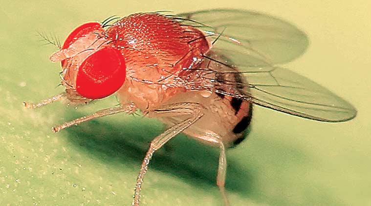
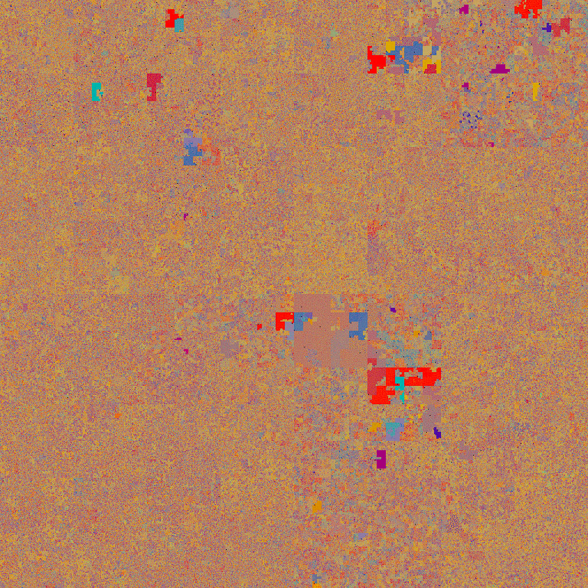
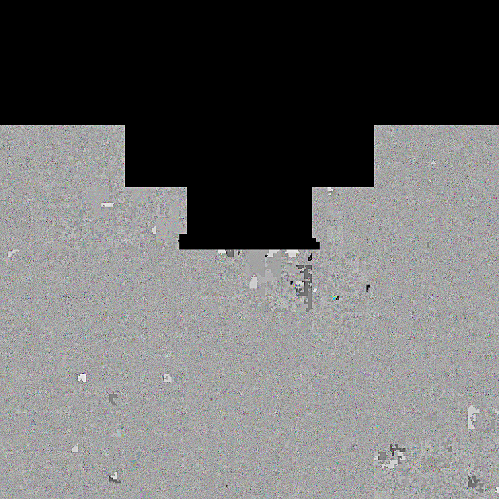
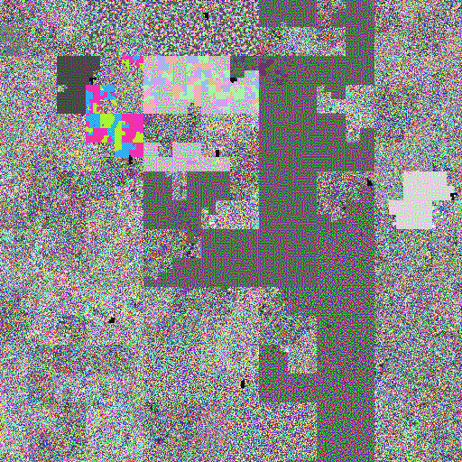
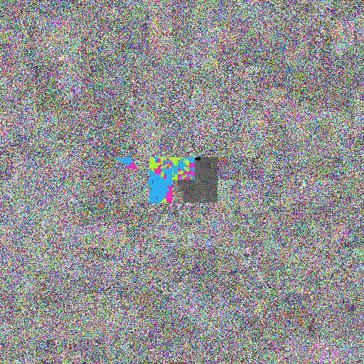
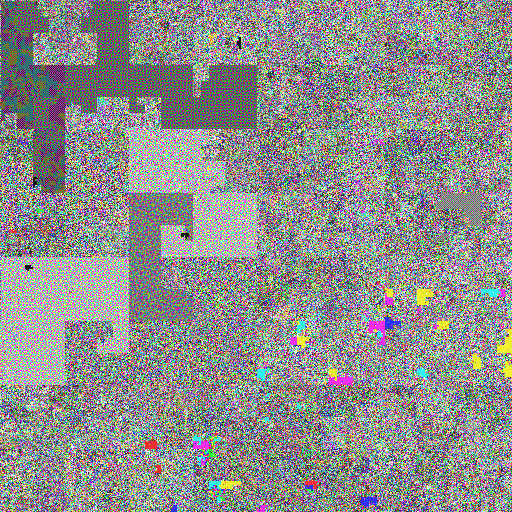

Ailove-Hilbert
==============

Binary to <a href="http://en.wikipedia.org/wiki/Hilbert_curve">Hilbert</a> fractal converter. 
<a href="http://blog.notdot.net/2009/11/Damn-Cool-Algorithms-Spatial-indexing-with-Quadtrees-and-Hilbert-Curves">Very good article about it</a>

Usage
-----

    ./hilbert binary.file output.png [r|g|b]

Where r for rgb, g for grayscale and b for bitwise visualisation

This code was created for redis bitstrings visualisation. 

Self binary representation:
==============================

     ./hilbert hilbert hilbert.png g

Linux kernel
============

    ./hilbert /boot/vmlinu[tab] mykernel.png r

Seems like my kernel has holes ;)

DNA of Drosophila melanogaster
==============================

<a href="https://www.ncbi.nlm.nih.gov/genome/47?genome_assembly_id=1508903">Part of genome of an fruit fly.</a> Image contains 67M nucleotides.

- [A]denine - Red
- [G]uanine - Green
- [C]ytosine - Orange
- [T]hymine - blue

<a href="./genome.png">

</а>

Lenna representation
====================

Original
--------

Hilbertized raw
---------------

Compressed image representation
-------------------------------

Gradients representation
========================

Original
--------

Hilbertized raw
---------------

Original
--------

Hilbertized raw
---------------

